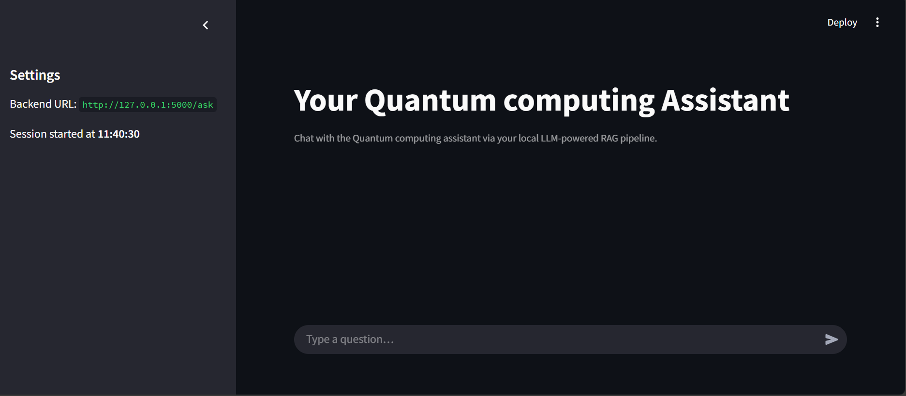

# RAG Embedding Pipeline: Quantum Notes QA


> A minimal, production-ready Retrieval-Augmented Generation (RAG) pipeline built on quantum computing lecture notes — powered by embedding models and an LLM backend.
---

## 📌 Project Purpose

This project demonstrates an end-to-end **RAG (Retrieval-Augmented Generation)** setup using a knowledge base of **Quantum Computing notes**. It allows you to ask questions in natural language, retrieve relevant document chunks using semantic search, and generate meaningful answers with an LLM.

The goal is to showcase a lightweight, modular, and practical example of how RAG works in real-world scenarios.

---

## 🚀 Features

- 🧠 Embeddings via [`BAAI/bge-base-en-v1.5`](https://huggingface.co/BAAI/bge-base-en-v1.5)
- 🗂️ Vector store using **ChromaDB**
- 🧾 Knowledge base built from structured quantum lecture notes
- 🔍 Contextual search for relevant text chunks
- 🤖 Response generation with [`google/gemma-2b-it`](https://huggingface.co/google/gemma-2b-it)
- 🌐 Flask-based API backend (`flask_app/`)
- 💻 Minimal UI using Streamlit (`ui/`)
- 🐳 Docker support for containerized execution

---
## 🧱 Folder Structure
```
.
├── flask_app/ # Flask backend for LLM-based querying
├── ui/ # Streamlit UI for interactive RAG querying
├── data/ # Source quantum notes / documents
├── chroma_bge_768/ # ChromaDB vector store (populated with BGE embeddings)
├── src/ # Embedding & retrieval logic
├── app.py # Entrypoint (for inference)
├── requirements_llm_v3.txt
```
---
## 📒 Notebooks Overview

This project includes two Jupyter notebooks for development, experimentation, and debugging:

### 📘 `01-rag-pipeline-setting.ipynb`
- Used for end-to-end experimentation with vector DB creation
- Loads and splits the quantum notes
- Generates embeddings using `BAAI/bge-base-en-v1.5`
- Saves the processed data to ChromaDB
- Explores basic prompt structuring and QA via local functions

### 📙 `02-rag-inference-pipeline.ipynb`
- Uses the vector DB created earlier
- Loads and tests the RAG pipeline with stored embeddings
- Sends context to the LLM (`google/gemma-2b-it`) with different prompts
- Mimics what the production `app.py` does


> ✅ `app.py` is a productionized version of the logic used in the second notebook.

---


## 🐳 How to Run with Docker

> Make sure Docker is installed and Hugging Face models are downloaded locally.

---

### 📥 Step 1: Clone and Enter the Flask App Folder

```bash
git clone https://github.com/khotveer/rag-embedding-pipeline.git
cd rag-embedding-pipeline/flask_app
```
Then, open **config.py** and add your Hugging Face token:
```python
# config.py
hugging_face_token = "your_huggingface_token_here"
```


### 📦 Step 2: Download Required Models from Hugging Face

Before building Docker, manually download these models locally:

- Embedding Model: BAAI/bge-base-en-v1.5
- LLM Model: google/gemma-2b-it

They will be saved to: ~/.cache/huggingface on your machine.

### 🐳 Step 3: Build and Run the Docker Container
```bash 
# Build the container
docker build -t quantum_notes_rag .

# Run the container with mounted model cache
docker run -p 5000:5000 -v "$HOME/.cache/huggingface:/root/.cache/huggingface" quantum_notes_rag
```
- Flask API will be available at: http://localhost:5000/query
- Models will load faster using the shared local cache.

## 💻 Streamlit UI (`/ui` folder)

A minimal UI built with **Streamlit** allows interactive querying of the RAG pipeline.

### 🔧 How to Run the Streamlit App

From the project root:

```bash
cd ui
streamlit run streamlit_app.py --server.port 7860
```

---

## 🖼️ Screenshots

### 🧠 Streamlit UI: Home Page


---

### 📝 Sample Query & Answer


---


## 🔗 Connect with Me

If you're interested in RAG pipelines, LLM integration, or applied AI projects, feel free to connect:

**🔗 [Veer Khot on LinkedIn](https://www.linkedin.com/in/veer-khot-93177bab/)**

---


